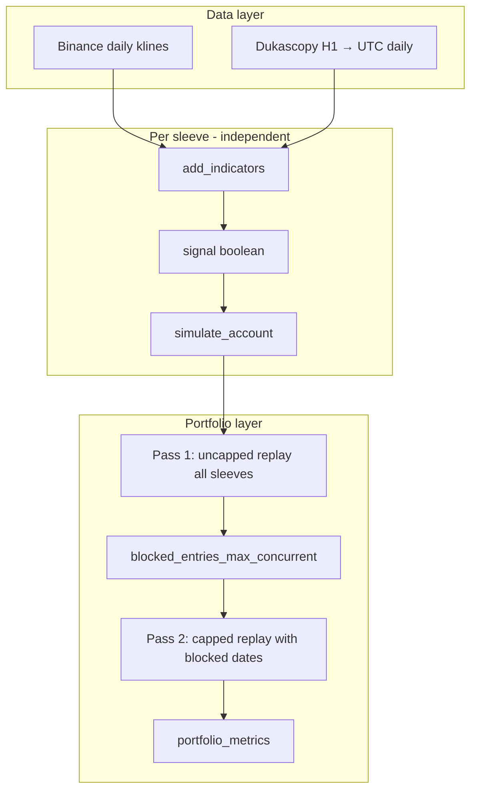

# Simona 2.0 — Algorithm Specification (Expert Review)

> **Single file for sharing:** [`SIMONA_COMPLETE_DOCUMENTATION.md`](SIMONA_COMPLETE_DOCUMENTATION.md) — spec + metrics + expert review + all May 2026 updates.

**Version:** May 2026 (live configuration)  
**Purpose:** Standalone technical description of the trading system for independent review.  
**Code references:** `btc_breakout_paper_sim.py` (engine), `btc_breakout_binance_paper_bot.py` (live parameters), `strategy_validation.py` (portfolio replay).

**Expert review response:** [`EXPERT_REVIEW_RESPONSE.md`](EXPERT_REVIEW_RESPONSE.md) (critique + empirical follow-up).

**Out of scope:** Telegram alerts, GitHub Actions, deployment, and brokerage integration. The system is **paper / signal-only**; it does not place exchange orders in the reviewed codebase.

---

## Table of contents

1. [Executive summary](#1-executive-summary)
2. [System architecture](#2-system-architecture)
3. [Universe and capital](#3-universe-and-capital)
4. [Market data and bar construction](#4-market-data-and-bar-construction)
5. [Indicators](#5-indicators)
6. [Entry signal (formal definition)](#6-entry-signal-formal-definition)
7. [Execution and timing](#7-execution-and-timing)
8. [Position sizing](#8-position-sizing)
9. [Exit rules](#9-exit-rules)
10. [Portfolio-level constraints](#10-portfolio-level-constraints)
11. [Costs and PnL accounting](#11-costs-and-pnl-accounting)
12. [Live parameter table (all sleeves)](#12-live-parameter-table-all-sleeves)
13. [Backtest methodology and reported metrics](#13-backtest-methodology-and-reported-metrics)
14. [Historical performance summary (2018+)](#14-historical-performance-summary-2018)
15. [Research conducted and rejected changes](#15-research-conducted-and-rejected-changes)
16. [Known limitations and model risk](#16-known-limitations-and-model-risk)
17. [Open questions for the reviewer](#17-open-questions-for-the-reviewer)
18. [Reproducibility](#18-reproducibility)

---

## 1. Executive summary

**Simona 2.0** is a **long-only, daily-bar, multi-asset breakout continuation** system. Each instrument (“sleeve”) runs the **same rule engine** with **instrument-specific** lookback, buffer, hold window, regime filter, and (for crypto) hard stop percentage.

**Core hypothesis:** After price consolidates below a rolling ceiling defined by the maximum **daily close** over the prior *N* sessions, a **confirmed** close breakout above that ceiling—by at least a minimum buffer but not beyond an exhaustion cap—tends to continue for several sessions when a medium-term trend filter is active.

**Distinctive design choices:**

| Choice | Rationale |
|--------|-----------|
| Close-based breakout (not high) | Signal uses settled daily close; intraday spikes through resistance that fail to hold do not fire |
| Next-session open entry | Avoids same-bar lookahead; introduces overnight gap risk explicitly |
| Volatility-scaled sizing | Risk per trade scales inversely with 20-day realized vol |
| Dynamic hold with momentum fade | Exit early after minimum hold if trend weakens; otherwise cap at maximum hold |
| Per-symbol crypto hard stops | Limit tail loss on volatile sleeves; metals/oil have no hard stop in live config |
| Book cap on concurrent positions | At most **4** sleeves open simultaneously (first-come-first-served by entry date) |

**Live book (May 2026):** **8 sleeves**, **$100,000** total notional (**$12,500** per sleeve, compounded per sleeve), **max 4 concurrent** entries.

---

## 2. System architecture



Each sleeve maintains its own equity curve, trade list, and parameters. **No cross-sleeve signal logic** except the portfolio concurrent-entry cap applied in pass 2.

---

## 3. Universe and capital

### 3.1 Live symbols (`LIVE_SYMBOLS`)

| Symbol | Data source | Asset class |
|--------|-------------|-------------|
| BTCUSD | Dukascopy | Crypto (CFD proxy) |
| ETHUSDT | Binance spot daily | Crypto |
| BNBUSDT | Binance spot daily | Crypto |
| SOLUSDT | Binance spot daily | Crypto |
| DOGEUSDT | Binance spot daily | Crypto |
| XAUUSD | Dukascopy | Gold |
| XAGUSD | Dukascopy | Silver |
| BRENT | Dukascopy | Brent crude |

**Note:** `XCUUSD` (copper) remains in `LIVE_STRATEGY_PARAMS` for research aliases but is **not** in the live 8-sleeve book.

### 3.2 Capital

| Parameter | Value |
|-----------|-------|
| Total portfolio notional | $100,000 |
| Sleeves | 8 |
| Equity per sleeve | $12,500 (equal weight) |
| Compounding | **Yes** (`compound=True` per sleeve) |
| Max concurrent open positions | **4** (`LIVE_MAX_CONCURRENT_ENTRIES`) |

Global sizing defaults (all sleeves): `vol_target = 1.5%`, `max_alloc = 75%`.

---

## 4. Market data and bar construction

### 4.1 Binance sleeves

- Endpoint: Binance REST daily klines (`interval=1d`).
- Only **fully closed** candles are used (`close_time < now`).
- Index: UTC timestamp at bar open.

### 4.2 Dukascopy sleeves

- Hourly bars downloaded and resampled to **UTC calendar days**:
  - `open` = first hour open  
  - `high` = max of hourly highs  
  - `low` = min of hourly lows  
  - `close` = last hour close  
- Local Parquet cache under repo data paths (see `dukascopy_cache_path()`).

### 4.3 Warm-up

Indicators require approximately **200+ daily bars** before `sma200`, `prior_high`, and `vol20` are well-defined. Early bars may produce `signal = false` due to NaNs or regime off.

### 4.4 Saturday entry deferral (Dukascopy only)

`skip_saturday_entry=True` for Dukascopy sources: if a pending signal would enter on **Saturday UTC**, entry is deferred to the next eligible session (typically Monday). Binance crypto sleeves **do not** skip Saturday.

---

## 5. Indicators

Computed in `add_indicators(df, cfg)` on the daily OHLCV series.

| Symbol | Formula |
|--------|---------|
| `ret[t]` | `close[t] / close[t-1] - 1` |
| `vol20[t]` | Standard deviation of `ret` over 20 sessions |
| `atr14[t]` | 14-day mean of \|`ret`\| (used only if `trail_atr > 0`; **live = 0**) |
| `n_atr20[t]` | 20-day mean of Wilder-style true range (for Turtle research / ATR stops) |
| `sma50`, `sma100`, `sma200` | Simple moving average of `close` |
| `sma50_slope20` | `sma50[t] - sma50[t-20]` |
| `sma200_slope20` | `sma200[t] - sma200[t-20]` |
| `prior_high[t]` | `max(close[t-L : t-1])` where *L* = `lookback` (excludes current bar) |
| `breakout_bps[t]` | `10,000 × (close[t] / prior_high[t] - 1)` |
| `regime_on[t]` | Boolean from `trend_mode` (see §6.3) |
| `signal[t]` | Composite entry eligibility (see §6) |

**Critical:** Breakout level uses **prior closes only**, not prior highs. A wick above the band with a close below does **not** count as a breakout.

---

## 6. Entry signal (formal definition)

On bar *t* (after the close is known), define:

### 6.1 Raw breakout

\[
\text{close}[t] > \text{prior\_high}[t] \times \left(1 + \frac{\text{buffer\_bps}}{10{,}000}\right)
\]

`buffer_bps` is sleeve-specific (e.g. 125 bps = 1.25% above the rolling ceiling).

### 6.2 Exhaustion cap

\[
\text{breakout\_bps}[t] \leq \text{max\_breakout\_bps}
\]

Live default: **225 bps (2.25%)** for all sleeves. Breakouts larger than this are skipped as “too stretched.”

### 6.3 Regime filter (`trend_mode`)

Live modes in use:

| `trend_mode` | Condition |
|--------------|-----------|
| `bull_only` | `close[t] > sma200[t]` |
| `sma200_95` | `close[t] > 0.95 × sma200[t]` |

Other modes exist in code (`sma100`, `sma50_slope_up`, `all`, etc.) for research only.

### 6.4 Final signal (live)

\[
\text{signal}[t] = \text{raw\_breakout} \land \text{not\_exhausted} \land \text{regime\_on}[t]
\]

**Research-only gates** (all **off** in live): two-close confirmation, close-in-range filter, range expansion filter, weekly SMA filter, adaptive wide lookback, backup 55-day entry, meta vol percentile cap, max gap at entry, signal decay timer. See §15.

### 6.5 Flat-state behavior

While **in a position**, new `signal[t] = true` values are **ignored**. No pyramiding in live config (`max_pyramid_units = 1`).

---

## 7. Execution and timing

This section is essential for reproducing results and for expert scrutiny of lookahead bias.

### 7.1 Signal bar vs entry bar

| Day | Role |
|-----|------|
| *t − 1* (signal bar) | Close prints; `signal[t-1]` evaluated; sizing uses `vol20[t-1]` |
| *t* (entry bar) | If flat and pending signal, **buy at `open[t]`** |

The simulator reads **`signal[i-1]`** on iteration *i* (`todays_signal_i = i - 1`). There is **no same-bar entry** on the signal close.

### 7.2 Pending signal state machine

1. When flat and `signal[t-1]` is true, store `pending_signal_i = t-1`.
2. On subsequent bars, attempt entry at open subject to:
   - not blocked by portfolio cap (`blocked_entry_dates`)
   - not Saturday (Dukascopy)
   - not in HWM pause (research overlay; **off** in live)
   - gap / meta filters (live: **off**)
   - `size_frac > 0` (requires valid `vol20`)
3. Successful entry clears pending state.

### 7.3 Recorded diagnostics per trade

| Field | Definition |
|-------|------------|
| `next_open_gap_pct` | `100 × (entry_open / signal_close - 1)` |
| `open_to_exit_pct` | `100 × (exit_px / entry_open - 1)` |
| `breakout_bps` | At signal bar |
| `size_frac` | Fraction of sizing equity deployed |

---

## 8. Position sizing

### 8.1 Live mode: volatility targeting (`sizing_mode = "vol"`)

On the **signal bar** (index `signal_i`):

\[
\text{size\_frac} = \min\left(\text{max\_alloc},\ \frac{\text{vol\_target}}{\text{vol20}[\text{signal\_i}]}\right)
\]

| Parameter | Live value |
|-----------|------------|
| `vol_target` | 0.015 (1.5% daily vol target) |
| `max_alloc` | 0.75 (75% of sleeve equity cap) |

\[
\text{entry\_notional} = \text{sizing\_equity} \times \text{size\_frac}
\]

\[
\text{qty} = \frac{\text{entry\_notional}}{\text{open}[\text{entry\_bar}]}
\]

- If `compound=True`, `sizing_equity` = current sleeve equity at entry.
- If `vol20` is NaN or ≤ 0, `size_frac = 0` → **no entry**.

### 8.2 Research-only: Turtle ATR risk sizing

`sizing_mode = "atr_risk"` sizes by fixed risk per 2×N stop distance. **Not live.** See `turtle_adoption_validation.py`.

---

## 9. Exit rules

### 9.1 Priority order (while in position)

Exits are evaluated each bar in this order:

1. **Hard stop** (crypto sleeves with `stop_loss_pct > 0`) — intraday **low** touches stop; fill at stop price.
2. **Trail stop** (`trail_atr` or `trail_n_mult`) — **off** in live (`trail_atr = 0`, `trail_n_mult = 0`).
3. **Channel exit** (`exit_channel_lookback > 0`) — **off** in live.
4. **Dynamic time / momentum exit** (live for all sleeves with `dynamic_hold=True`).
5. **Force close** at last bar of sample if still open.

### 9.2 Hard stop (crypto)

\[
\text{stop\_px} = \text{entry\_px} \times (1 - \text{stop\_loss\_pct})
\]

Triggered when `low[t] <= stop_px` (if `stop_use_low=True`). Can fire from day 1 of the trade.

| Symbol | `stop_loss_pct` |
|--------|-----------------|
| BTCUSD | 5% |
| ETHUSDT | 6% |
| BNBUSDT | 5% |
| SOLUSDT | 12% |
| DOGEUSDT | 12% |
| XAUUSD, XAGUSD, BRENT | **none** (0 = off) |

Optional Turtle ATR stop floor exists in code (`stop_atr_mult`); **live uses percentage only**.

### 9.3 Dynamic hold (live)

Parameters per sleeve: `hold_min`, `hold_max`, `dynamic_hold=True`, `hold_giveback_pct=0.03`.

Let `hold_bars` = sessions since entry (inclusive).

**Maximum hold:** exit at close when `hold_bars >= hold_max` (reason: `max_hold`).

**Minimum hold:** before `hold_min`, only stops can exit.

**Between `hold_min` and `hold_max`:** exit at close if **momentum faded**:

`momentum_faded` is true if **any** of:

1. **Giveback:** `close[t] <= peak_close × (1 - hold_giveback_pct)` where `peak_close` is max close since entry.
2. **Below SMA50:** `close[t] < sma50[t]`.
3. **SMA50 slope negative:** `sma50_slope20[t] < 0`.

If `exit_channel_lookback > 0` and `channel_exit_replaces_fade=False`, channel break can also exit after `hold_min` (live: channel off).

**Partial exit on fade (research):** `partial_exit_frac` — live **0** (full exit).

### 9.4 What does *not* exit a trade

- Opposite signal while still in position  
- Regime turning off (`close` falling below SMA200) — unless momentum fade or stop fires  
- Take-profit level  
- Trailing stop (live)

---

## 10. Portfolio-level constraints

### 10.1 Max concurrent entries

**Rule:** At most **4** sleeves may have an open position on any calendar day.

**Implementation (two-pass replay):**

1. **Pass 1:** Run all sleeves with **no** portfolio cap; collect all trades.
2. **Build block list:** Sort all trades by `entry_date`. Walk chronologically; when a new entry would be the 5th+ concurrent position, add that entry date to `blocked_entry_dates` for that sleeve.
3. **Pass 2:** Re-run each sleeve with its blocked dates; entries on blocked days are skipped (pending signal cleared).

This is **first-come-first-served (FCFS)** by entry timestamp, not correlation-prioritized. Research mode `marginal_risk_4` tested low-correlation priority; did not beat baseline.

**Historical impact (2018+, live book):** 8 entry days blocked across the full sample (~250 trades total).

### 10.2 Metrics aggregation

- **Book equity** = sum of sleeve equity series (aligned by date, forward-filled).
- **Book return** = `(final_book_equity / 100_000) - 1`.
- **Book max drawdown** = drawdown on summed equity (typically **much shallower** than worst sleeve DD).
- **Worst sleeve DD** = max of per-sleeve peak-to-trough drawdowns (often **SOLUSDT ~ −13%**).

---

## 11. Costs and PnL accounting

### 11.1 Fees

Per side: `fee_bps / 10,000 × notional`.

| Sleeve group | `fee_bps` | Round-trip approx. |
|--------------|-----------|---------------------|
| Crypto, DOGE | 10 | ~20 bps |
| BRENT | 5 | ~10 bps |
| XAU, XAG | 2 | ~4 bps |

Entry fee deducted from equity at entry; exit fee at exit.

### 11.2 Not modeled

- Bid-ask spread  
- Slippage (beyond implicit open vs close assumption)  
- Perpetual **funding** (Binance futures)  
- Borrow / margin interest  
- Partial fills, halts, delistings  

---

## 12. Live parameter table (all sleeves)

Shared engine defaults: `vol_target=1.5%`, `max_alloc=75%`, `max_breakout_bps=225`, `compound=True`, `trail_atr=0`, `dynamic_hold=True`, `hold_giveback_pct=3%`, `max_pyramid_units=1`.

| Sleeve | Source | Lookback | Buffer (bps) | Regime | hold_min | hold_max | Stop % |
|--------|--------|----------|--------------|--------|----------|----------|--------|
| BTCUSD | Dukascopy | 15 | 125 | bull_only | 5 | 10 | 5% |
| ETHUSDT | Binance | 10 | 150 | bull_only | 10 | 13 | 6% |
| BNBUSDT | Binance | 15 | 125 | bull_only | 6 | 10 | 5% |
| SOLUSDT | Binance | 20 | 75 | sma200_95 | 9 | 15 | 12% |
| DOGEUSDT | Binance | 30 | 75 | sma200_95 | 9 | 15 | 12% |
| XAUUSD | Dukascopy | 30 | 100 | sma200_95 | 9 | 15 | — |
| XAGUSD | Dukascopy | 30 | 100 | bull_only | 13 | 15 | — |
| BRENT | Dukascopy | 30 | 75 | sma200_95 | 9 | 15 | — |

**Interpretation notes:**

- **BTC** uses the shortest minimum hold (5d) after crypto hold-tuning.  
- **ETH** uses a shorter lookback (10d) and wider buffer (150 bps).  
- **SOL / DOGE** use looser regime (`sma200_95`) and wider 12% stops.  
- **XAG** has the longest minimum hold (13d).  
- **BRENT** uses a tighter buffer (75 bps) with 30d lookback.

---

## 13. Backtest methodology and reported metrics

### 13.1 Sample period

- **Data start:** 2018-01-01 (`DATA_START`)  
- **Simulation start:** 2018-01-01 (`SIM_START`)  
- **End:** last available daily bar per source  

### 13.2 Promotion gate (parameter changes)

A candidate configuration **passes** vs baseline only if **all** hold within tolerance (`beats_baseline` in `strategy_validation.py`):

| Metric | Tolerance vs baseline |
|--------|------------------------|
| Total return % | ≥ baseline − **0.08 pp** |
| Profit factor | ≥ baseline − **0.03** |
| Max drawdown % | ≥ baseline − **0.12 pp** (less negative = shallower) |

Optimization target is **robust book-level** stats, not maximum trade count or single-sleeve return.

### 13.3 Reported portfolio metrics

| Metric | Definition |
|--------|------------|
| Return % | On summed book equity |
| CAGR % | Compound annual growth from return and calendar span |
| Max drawdown % | Peak-to-trough on book equity |
| Profit factor | Sum wins / \|sum losses\| on trade `net_pnl` |
| Sharpe ratio | Mean / std of **daily** book equity returns × √252 |
| Annualized vol % | Std of daily book returns × √252 |
| Calmar | CAGR % / \|max DD %\| |
| Worst sleeve DD | Max of per-sleeve drawdowns |

**Always interpret book DD together with worst-sleeve DD** — diversification compresses book drawdown (~−1.6%) while individual sleeves can draw down ~−10% to −13%.

---

## 14. Historical performance summary (2018+)

**Configuration:** Live parameters, per-symbol crypto stops, max **4** concurrent, 8 sleeves, $100k start.

| Metric | Book | Notes |
|--------|------|-------|
| Total return | **105.2%** | |
| CAGR | **8.95%** | |
| Max drawdown | **−1.61%** | Summed equity |
| Profit factor | **3.58** | |
| Sharpe | **1.66** | Daily book equity |
| Trades | **250** | |
| Worst sleeve DD | **−13.0%** | SOLUSDT |
| Calmar | **5.55** | |

### 14.1 Per-sleeve snapshot (full sample)

| Sleeve | Trades/yr (approx.) | Full return | Full PF |
|--------|---------------------|-------------|---------|
| BTCUSD | 6.9 | 93.6% | 2.30 |
| ETHUSDT | 6.0 | 196.2% | 4.37 |
| BNBUSDT | 5.1 | 89.1% | 3.93 |
| SOLUSDT | — | (see validation JSON) | — |
| DOGEUSDT | — | (see validation JSON) | — |
| XAUUSD | 5.9 | 32.1% | 2.13 |
| XAGUSD | 5.1 | 94.6% | 2.72 |
| BRENT | — | (see validation JSON) | — |

**Out-of-sample note (ex-2024 window):** ETH and BNB show strong ex-2024 profit factors in prior reports; BTC is weaker ex-2024 (PF ~1.14). Treat sleeve-level OOS as **mixed**, not uniformly strong.

### 14.2 Benchmark context (same data, max 4 concurrent)

| System | Return | Book DD | Sharpe |
|--------|--------|---------|--------|
| **Simona live** | 105.2% | −1.61% | 1.66 |
| Turtle S1 replay (same 8 symbols) | 67.4% | −2.75% | 0.97 |
| OSS template proxies (MACD, BB break, etc.) | higher raw return possible | **−9% to −19%** typical | ~1.0–1.1 |

---

## 15. Research conducted and rejected changes

The engine supports many experimental hooks; **live uses the baseline subset only.** The following were tested and **not promoted** (see scripts in repo):

| Category | Examples | Outcome |
|----------|----------|---------|
| Turtle exits | 10d channel, 2N trail, replace momentum fade | Reject — hurts Sharpe/DD or no-op |
| Turtle sizing / pyramid | ATR risk, 55d backup entry, pyramiding | Reject — return/DD tradeoff fails gate |
| False-breakout filters | Close-in-range, range expansion, weekly trend | Reject — cuts return |
| OOB portfolio | Signal decay, global risk-on, funding skip, marginal risk | Reject or no-op |
| Book overlays | Max 3 concurrent, HWM pause | Reject or negligible DD improvement |
| Frontier grid (May 2026) | vol×alloc×concurrent 75 cases | Only **max 5 concurrent** passes gate (+5% return, same DD) — **not live** |

**Near-miss (paper trial only):** `partial_exit_50` improves Sharpe (~1.81) with slightly worse book DD; `partial_exit_50 + max 5` → Sharpe ~1.84, DD ~−1.96%.

Full tables: `TRADING_STRATEGY_REPORT.md` §§13–17, `frontier_validation_results.json`.

---

## 16. Known limitations and model risk

1. **Paper vs live:** No order placement; real fills, funding, and spreads may differ.  
2. **BTC data:** Live sleeve uses **Dukascopy BTCUSD**, not Binance BTCUSDT — basis vs crypto sleeves.  
3. **Bar alignment:** Dukascopy UTC daily vs Binance daily may not match TradingView session boundaries exactly.  
4. **Portfolio cap causality:** Blocked entries depend on pass-1 trade set; path-dependent but deterministic.  
5. **Regime non-stationarity:** Bull-only / SMA200 filters may underperform in prolonged bear markets (long-only constraint).  
6. **Concentration:** Risk-on days can correlate entries across crypto sleeves before the cap binds.  
7. **Sharpe on daily book equity:** With shallow book DD, Sharpe is high; sleeve-level risk is larger.  
8. **In-sample tuning:** Per-sleeve parameters were tuned with promotion gate on overlapping history — standard overfitting risk applies.

---

## 17. Open questions for the reviewer

We welcome critique on the following:

1. **Signal definition:** Is close-based N-day max breakout with buffer + cap economically sensible vs high-based Donchian channels?  
2. **Entry timing:** Is next-open entry sufficient to avoid lookahead, or should signals be shifted further (e.g. T+2)?  
3. **Dynamic hold / momentum fade:** Are giveback + SMA50 + slope redundant? Better exit for trend-following?  
4. **Crypto hard stops vs metals none:** Is the asymmetric risk model justified?  
5. **Portfolio cap:** Is FCFS max-4 optimal vs risk-parity or correlation-aware allocation?  
6. **Vol sizing:** Is `vol_target / vol20` with 75% cap appropriate for fat-tailed crypto?  
7. **Data choices:** Dukascopy BTC + Binance alts — how would you unify execution assumptions?  
8. **OOS validity:** Which sleeves or eras would you treat as genuine out-of-sample?  
9. **Live promotion:** Is **max 5 concurrent** (+5% return, same replay DD) worth a paper trial?  
10. **Missing realism:** What single modeling addition (funding, slippage, regime off) would most likely invalidate results?

---

## 18. Reproducibility

From repository root (Python 3.10+, dependencies in project venv):

```bash
# Portfolio baseline + per-sleeve stats
python3 btc_breakout_clean/strategy_validation.py

# Pro vs Turtle benchmark
python3 btc_breakout_clean/pro_benchmark_comparison.py

# Return / DD / Sharpe frontier (May 2026)
python3 btc_breakout_clean/frontier_validation.py

# Daily paper signal run (no real orders)
python3 btc_breakout_clean/run_binance_paper_daily.py
```

**Outputs (gitignored):** `strategy_validation_results.json`, `frontier_validation_results.json`, `pro_benchmark_comparison_results.json`.

**Authoritative live constants:** `btc_breakout_binance_paper_bot.py` → `LIVE_SYMBOLS`, `LIVE_STRATEGY_PARAMS`, `LIVE_MAX_CONCURRENT_ENTRIES`.

---

*Document generated for external expert review. For internal narrative and evolution history, see `TRADING_STRATEGY_REPORT.md`.*
