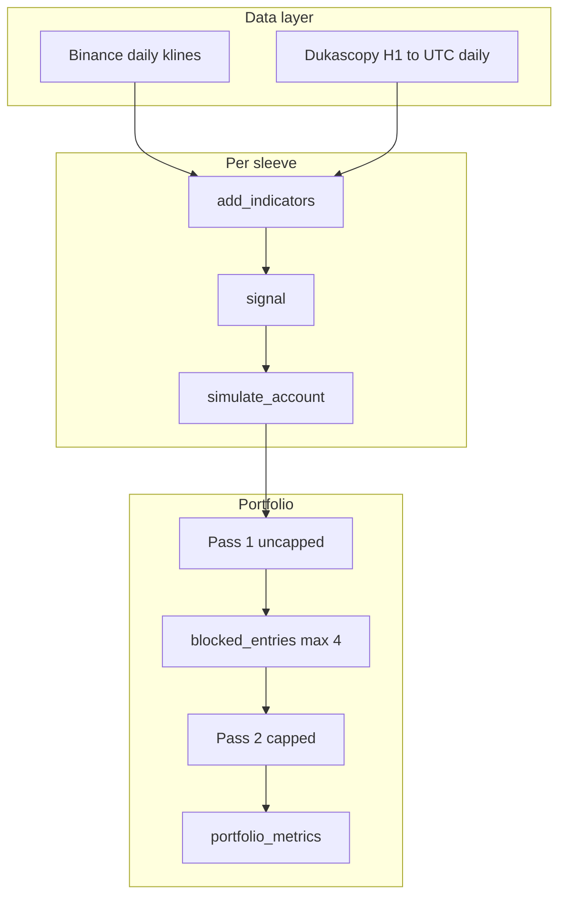

# Simona 2.0 — Complete Documentation (May 2026)

**Single file for expert review:** this document.  
**Amendments only (final pass):** [`DOCUMENTATION_AMENDMENTS_MAY2026.md`](DOCUMENTATION_AMENDMENTS_MAY2026.md)

**Code:** `btc_breakout_paper_sim.py` (engine) · `btc_breakout_binance_paper_bot.py` (live params) · `strategy_validation.py` (replay) · `review_feedback_analysis.py` (review metrics)

**Out of scope:** Telegram, deployment, live order placement. Paper/signal system uses **Binance spot daily klines** for crypto sleeves (not perps in this codebase).

---

# Part I — Algorithm specification

## 1. Executive summary

**Simona 2.0** is a **long-only, daily-bar, multi-asset breakout continuation** system. Each instrument (“sleeve”) runs the **same rule engine** with **instrument-specific** lookback, buffer, hold window, regime filter, and (for crypto) hard stop percentage.

**Core hypothesis:** After price consolidates below a rolling ceiling (max **daily close** over prior *N* sessions), a confirmed close breakout above that ceiling—by at least a buffer but not beyond an exhaustion cap—tends to continue for several sessions when a medium-term trend filter is on.

| Design choice | Rationale |
|---------------|-----------|
| Close-based breakout | Settled close only; intraday wicks through resistance do not fire |
| Next-session open entry | No same-bar lookahead; explicit overnight gap risk |
| Vol-scaled sizing | `vol_target / vol20`, capped at 75% of sleeve equity |
| Dynamic hold + momentum fade | Exit after `hold_min` if trend weakens; else `hold_max` |
| Per-symbol crypto hard stops | Tail risk on crypto; metals/oil have no hard stop |
| Max 4 concurrent sleeves | FCFS portfolio cap (rarely binds: 8 blocks in 7+ years) |

**Live book:** 8 sleeves · $100,000 total ($12,500/sleeve, compounded) · max **4** concurrent entries.

---

## 2. System architecture



---

## 3. Universe and capital

| Symbol | Data source | Asset class |
|--------|-------------|-------------|
| BTCUSD | Dukascopy *(migrate to Binance BTCUSDT planned)* | Crypto proxy |
| ETHUSDT, BNBUSDT, SOLUSDT, DOGEUSDT | Binance spot daily | Crypto |
| XAUUSD, XAGUSD, BRENT | Dukascopy | Metals / oil |

| Parameter | Value |
|-----------|-------|
| Total notional | $100,000 |
| Per sleeve | $12,500 |
| Compounding | Yes |
| Max concurrent | 4 |
| Global sizing | `vol_target=1.5%`, `max_alloc=75%` |

---

## 4. Market data and bars

- **Binance:** closed daily klines only (UTC).
- **Dukascopy:** H1 resampled to UTC daily (O/H/L/C standard).
- **Warm-up:** ~200+ bars for SMA200 and rolling windows.
- **Saturday skip:** Dukascopy sleeves defer Saturday entry to Monday; Binance sleeves do not.

---

## 5. Indicators

| Field | Definition |
|-------|------------|
| `prior_high[t]` | `max(close[t-L:t-1])`, L = `lookback` |
| `breakout_bps[t]` | `10,000 × (close/prior_high − 1)` |
| `vol20` | 20-day std of close-to-close returns |
| `signal[t]` | Raw breakout ∧ cap ∧ regime (see §6) |

Breakout uses **closes only**, not highs.

---

## 6. Entry signal

**Raw breakout:** `close > prior_high × (1 + buffer_bps/10,000)`

**Exhaustion cap (live):** `breakout_bps ≤ 225` (2.25%)

**Regime (live):**

| Mode | Rule |
|------|------|
| `bull_only` | `close > SMA200` |
| `sma200_95` | `close > 0.95 × SMA200` |

**Final:** `signal = raw_breakout ∧ not_exhausted ∧ regime_on`

While in a position, new signals are **ignored** (no pyramiding).

---

## 7. Execution and timing

| Day | Role |
|-----|------|
| *t−1* | Signal evaluated on close; sizing uses `vol20[t-1]` |
| *t* | Entry at **`open[t]`** if flat and yesterday signaled |

No same-bar entry on signal close. Pending signals can be blocked (portfolio cap, Saturday, etc.).

---

## 8. Position sizing

```
size_frac = min(max_alloc, vol_target / vol20)
entry_notional = sizing_equity × size_frac
```

`sizing_equity` = current sleeve equity if `compound=True`. If `vol20 ≤ 0`, no entry.

---

## 9. Exit rules

**Priority:** (1) hard stop on low (2) trail — **off** live (3) channel — **off** live (4) dynamic hold / momentum fade (5) force close at end of data.

**Crypto hard stops:**

| Symbol | Stop % |
|--------|--------|
| BTCUSD | 5% |
| ETHUSDT | 6% |
| BNBUSDT | 5% |
| SOLUSDT, DOGEUSDT | 12% |
| XAU, XAG, BRENT | none |

**Momentum fade** (after `hold_min`, before `hold_max`) if **any**:

1. Close ≤ peak_close × (1 − 3% giveback)
2. Close < SMA50
3. SMA50_slope20 < 0 *(ablation planned: drop #3)*

---

## 10. Portfolio constraints

- **Max 4 concurrent** sleeves (FCFS by entry date).
- Two-pass replay: uncapped → block list → capped replay.
- **8 blocked entry days** in full 2018+ sample.

**Book metrics:** sum of sleeve equity curves (ffill-aligned). **Book DD ≠ sleeve risk:** report both.

---

## 11. Costs and gaps

| Fees (per side) | bps |
|-----------------|-----|
| Crypto / DOGE | 10 |
| BRENT | 5 |
| XAU / XAG | 2 |

**Not modeled:** spread, slippage, **perp funding** (stress-tested separately), partial fills.

**Execution venue in code:** spot daily klines, paper only.

---

## 12. Live parameter table

| Sleeve | Src | LB | Buf | Regime | hold_min | hold_max | Stop |
|--------|-----|-----|-----|--------|----------|----------|------|
| BTCUSD | DUK | 15 | 125 | bull_only | 5 | 10 | 5% |
| ETHUSDT | BIN | 10 | 150 | bull_only | 10 | 13 | 6% |
| BNBUSDT | BIN | 15 | 125 | bull_only | 6 | 10 | 5% |
| SOLUSDT | BIN | 20 | 75 | sma200_95 | 9 | 15 | 12% |
| DOGEUSDT | BIN | 30 | 75 | sma200_95 | 9 | 15 | 12% |
| XAUUSD | DUK | 30 | 100 | sma200_95 | 9 | 15 | — |
| XAGUSD | DUK | 30 | 100 | bull_only | 13 | 15 | — |
| BRENT | DUK | 30 | 75 | sma200_95 | 9 | 15 | — |

---

# Part II — Performance, utilization & methodology

## 13. Backtest setup

- **Period:** 2018-01-01 → last available bar  
- **Book start:** $100,000 (8 × $12,500)  
- **Promotion gate:** return ≥ baseline − 0.08 pp, PF ≥ baseline − 0.03, DD ≥ baseline − 0.12 pp  

## 14. Full-sample results (2018+, live params, max 4 concurrent)

### 14.1 Book headline *(always report with utilization and worst-sleeve DD)*

| Metric | Value |
|--------|-------|
| Total return | **105.2%** |
| CAGR | **8.95%** |
| **Book max DD** | **−1.61%** |
| **Worst sleeve DD** | **−13.0%** (SOLUSDT) |
| Profit factor | **3.58** |
| PF bootstrap 95% CI | **[2.56, 5.00]** |
| Sharpe (daily book equity) | **1.66** |
| Ann. vol (book) | **3.6%** |
| Calmar | **5.55** |
| Trades | **250** (~31/sleeve) |

### 14.2 Capital utilization *(corrected May 2026)*

| Metric | Value |
|--------|-------|
| Mean deployed / book equity | **6.7%** |
| Max deployed / book equity | **44.0%** |
| Mean concurrent open sleeves *(when in market)* | **1.72** |
| Days with ≥1 position | **53.3%** |
| Days at max-4 cap | **3.1%** |
| Blocked entries (full sample) | **8** |

**Interpretation:** Functionally a **low-concurrency serial book** most of the time. Book DD is low partly because **capital is idle**, not because per-position risk is small. Sharpe is computed on **book equity** (~3.6% vol), not on deployed capital.

> **Footnote — max utilization 44% vs earlier 75.7%:** An earlier draft reported **75.7%** peak utilization. That used `sum(sleeve_equity)` with `fill_value=0` on misaligned dates, which **understated book equity** on days when some sleeves had not yet started or had missing index rows — inflating `deployed / book`. The **44.0%** figure uses `portfolio_equity_series()` (per-sleeve forward-fill to $12.5k, then sum), matching book metrics elsewhere. Mean utilization shifted similarly (**7.7% → 6.7%**). **No other backtest metrics changed** (returns, DD, PF, trades); only the utilization denominator was corrected.

### 14.3 Per-sleeve drawdowns (full sample)

| Sleeve | Max DD % |
|--------|----------|
| SOLUSDT | −13.0 |
| ETHUSDT | −10.8 |
| BRENT | −10.2 |
| XAGUSD | −8.3 |
| BTCUSD | −8.6 |
| BNBUSDT | −8.4 |
| DOGEUSDT | −7.0 |
| XAUUSD | −3.7 |

**Per-sleeve risk notes:** **XAGUSD** — longest minimum hold (13d), `bull_only`, **no hard stop**; most exposed metals sleeve in prolonged risk-off (2022: **−$1,148** calendar-year PnL while crypto sat flat). **SOLUSDT** — deepest full-sample sleeve DD (−13%).

### 14.4 Profit factor bootstrap (selected)

| Cohort | n | PF | 95% CI |
|--------|---|-----|--------|
| Book full | 250 | 3.58 | [2.56, 5.00] |
| Book ex-2024 | 89 | 4.18 | [2.38, 7.23] |
| BTC ex-2024 | 14 | 1.79 | **[0.41, 7.37]** |
| ETH ex-2024 | 9 | 5.51 | [0.86, 30.96] |
| BNB ex-2024 | 13 | 1.81 | [0.32, 7.22] |

**Claim discipline:** pooled book edge is plausible; **sleeve-level OOS is not proven** (wide CIs, small n).

### 14.5 Calendar holdout 2022-01-01 onward *(params frozen)*

| Metric | Value |
|--------|-------|
| Equity at 2022-01-01 | $133,353 |
| Equity at end | $205,209 |
| Return (equity path) | **+53.9%** |
| **Max DD (holdout window)** | **−1.60%** |
| Trades entered | 146 |
| PF | **3.73** |
| Sharpe (holdout equity) | 1.76 |

**Why holdout Sharpe (1.76) > full-sample Sharpe (1.66):** The holdout window starts at **$133k book equity on 2022-01-01** — after the 2018–2021 compounding phase and **after the worst book-level drawdown is already in the rearview** for that equity path. You are measuring from a recovered base through a mostly bullish 2022–2025 period, not from $100k inception through 2022 crypto winter. This does **not** mean the strategy improved post-2022; it reflects **window selection**.

**Caveats:** Calendar holdout **≠** regime-pure OOS (2022–present mostly bull for long-only crypto/gold). Return is from **$133k** at holdout start, not $100k inception. PF 3.73 is **suggestive**, not definitive proof.

*(Prior −34% holdout DD was a bug: sleeve series summed without aligned ffill; fixed via `portfolio_equity_series()`.)*

### 14.6 Calendar-year net PnL *(regime sensitivity)*

Cumulative metrics compress bad years. Below: **realized `net_pnl` by calendar year of trade entry** (USD, live replay, max 4 concurrent).

> **Footnote — entry-year attribution:** Full trade PnL is counted in the **entry** calendar year even when the exit falls in the next year (e.g. late-December entry, January exit). At **5–15 day** hold windows this is usually a small distortion; **2025 and 2026 YTD** totals may be slightly affected by year-end straddles. No recompute required.

**Book total by year:**

| Year | Trades | Book net PnL | Note |
|------|--------|--------------|------|
| 2018 | 4 | **−$404** | Small sample; metals/oil only |
| 2019 | 20 | +$4,805 | |
| 2020 | 42 | +$15,233 | Covid / crypto bull |
| 2021 | 38 | +$13,718 | |
| 2022 | 15 | **+$1,551** | Crypto bear; **few trades** (regime filter off much of year) |
| 2023 | 42 | +$18,499 | |
| 2024 | 45 | +$29,913 | Strong crypto/metals year |
| 2025 | 36 | +$15,276 | |
| 2026 YTD | 8 | +$6,618 | Partial year |

**Selected sleeve calendar years (net PnL USD):**

| Year | BTCUSD | ETHUSDT | SOLUSDT | XAGUSD | DOGEUSDT |
|------|--------|---------|---------|--------|----------|
| 2022 | $0 | **−$733** | $0 | **−$1,148** | $0 |
| 2023 | +$3,382 | +$3,348 | +$6,534 | +$937 | +$1,401 |
| 2024 | **−$320** | +$10,290 | +$9,732 | +$722 | +$6,745 |
| 2025 | +$3,841 | +$30 | +$2,735 | +$4,712 | $0 |

**Takeaways for reviewers:**

- **2022 was barely positive (+$1.5k, 15 trades)** — regime filter kept the book largely flat through the crypto bear (feature by design). **Forward risk:** in a future multi-month sit-out, markets may recover before re-entry triggers (opportunity cost), which is not visible as a backtest loss.
- **XAG 2022 (−$1,148):** only notable metals loser; long hold + no stop in a risk-off year.
- **BTC 2024 was negative** (−$320 on 9 trades; PF ~0.78 that year) — sleeve-level losing years exist inside a positive cumulative curve.
- **2024–2025 concentration:** a large share of total PnL came from 2023–2025 (crypto bull + SOL/DOGE/ETH sleeves).
- We **lack a long flat/down OOS window** in history; calendar years help but do not replace a true regime-stress holdout.

### 14.7 Funding stress (if live execution uses perps)

| Funding per 8h | Drag USD | % of net PnL |
|----------------|----------|--------------|
| 0.01% (low bull) | ~2,127 | **~2%** |
| **0.05% (modal bull)** | ~10,634 | **~10%** |

Long-only wins in bull regimes when funding is elevated → **0.05%/8h is the relevant stress**, not the 0.01% tail.

### 14.8 BTC signal source: Dukascopy vs Binance BTCUSDT

| | Count |
|--|-------|
| Dukascopy signal days | 69 |
| Binance signal days | 69 |
| Exact same day | **61 (79%)** |
| Only Dukascopy / only Binance | 8 each |

**Action:** migrate BTC sleeve to Binance BTCUSDT for signal/execution parity.

### 14.9 Benchmarks (2018+, max 4)

| System | Return | Book DD | Sharpe |
|--------|--------|---------|--------|
| **Simona live** | 105.2% | −1.61% | 1.66 |
| Turtle S1 replay | 67.4% | −2.75% | 0.97 |
| OSS templates (MACD/BB) | higher return possible | −9% to −19% | ~1.0 |

---

# Part III — Expert review: critique and response

## 15. First-pass review summary

External review (May 2026) concluded: **well-specified, honest backtest**, but (1) **sample size too small** at sleeve level, (2) **225 bps cap** needs scrutiny, (3) **funding** if perps, (4) **BTC data drift**, (5) **book DD misleading** without utilization, (6) **promotion gate** overfitting risk, (7) **two-pass cap** minor live/backtest gap, (8) **momentum fade** redundancy.

**We agree** on all material points. Below: response with **empirical follow-up** (May 2026).

---

## 16. Exhaustion cap (>225 bps) — preview vs conclusion

**Reviewer:** Cap may filter best crypto momentum trades; need `breakout_bps > 225` cohort.

**Our analysis:** Forward returns from signal-bar close (**not** trade PnL: no stops, holds, fees, next-open). **Full `max_breakout_bps` backtest sweep required before any live change.**

| Symbol | n | Med bps | Mean 5d | **Median 5d** | Trim top 5% mean | % 5d + |
|--------|---|---------|---------|---------------|------------------|--------|
| BTCUSD | 116 | 421 | +2.3% | +0.9% | +0.9% | 55% |
| ETHUSDT | 163 | 458 | +3.1% | +1.6% | +1.5% | 57% |
| BNBUSDT | 152 | 454 | +5.2% | +1.0% | +2.2% | 55% |
| SOLUSDT | 113 | 559 | +5.5% | +3.3% | +3.2% | 63% |
| **DOGEUSDT** | 92 | 811 | **+15.4%** | **−1.2%** | **+4.2%** | 49% |
| XAUUSD | 14 | 255 | −1.1% | ~0% | −1.1% | 50% |
| XAGUSD | 49 | 322 | ~0% | +1.0% | −1.1% | 59% |
| BRENT | 30 | 330 | +0.2% | +0.3% | −1.0% | 53% |

**Conclusions:**

- **Crypto (ex-DOGE):** preview suggests stretched breaks are not obvious losers; cap may exclude continuation — **test via simulation**, not preview alone.
- **DOGE:** mean is **tail-driven** (median 5d **negative**); cap likely filters lottery spikes — **do not loosen DOGE cap** on preview data.
- **Gold:** tiny n; cap may help.

---

## 17. Reviewer Q&A (consolidated)

| # | Topic | Decision |
|---|-------|----------|
| 1 | Close vs high Donchian | **Keep close-based** |
| 2 | T+2 entry | **Keep next-open** |
| 4 | Crypto stops only | **Keep** asymmetric model |
| 5 | FCFS max-4 | **Keep**; cap rarely binds |
| 6 | Vol sizing | **max_alloc 50%** on SOL/DOGE — return-only tradeoff (~−2pp ret, worst −12%) |
| 7 | Data | **Keep BTC Dukascopy** — Binance migration worsens DD (−2.58%); metals/oil stay Dukascopy |
| 8 | OOS | **Book pooled plausible**; sleeves mixed |
| 9 | Max 5 concurrent | **Paper trial OK** (+5% ret, same book DD in replay) |
| 10 | Main invalidator | **Slippage** (next-open, thin alts) or **funding** (perps, modal 0.05%/8h) |

---

## 18. Second-pass review additions (May 2026)

| Topic | Update |
|-------|--------|
| Holdout DD | **Fixed** — −1.60% (not −34%); see §14.5 |
| Exhaustion preview | **Not conclusive** — need full sim; DOGE mean is tail-driven |
| Holdout PF 3.73 | Strong but **regime overlap** with tuning era; not regime-pure OOS |
| Serial trader | Mean **1.72** concurrent sleeves; max-4 binds **3.1%** of days |
| Funding | **0.05%/8h ≈ 10% of PnL** is modal stress if perps in bull |
| Utilization in reports | Now in **`strategy_validation.py`** header every run |

---

# Part IV — Research history and live stance

## 19. Tested and not promoted

| Category | Outcome |
|----------|---------|
| Turtle exits / trails / pyramid | Reject |
| False-breakout quality filters | Reject (cuts return) |
| OOB grid (19 modes) | Reject or no-op |
| Max 3 concurrent, HWM pause | Reject or negligible |
| Frontier grid (75 cases) | Only **max 5** passes gate — not live |
| Improvement batch (17 variants) | **All fail** gate — cap loosen adds volume not edge |
| **Next batch (May 2026)** | **All fail** gate — see §19.1 |
| **Momentum-fade ablation** | **Keep live** — see §19.2 |

**Near-miss (paper only):** `partial_exit_50` → Sharpe ~1.81; `partial_max5` → Sharpe ~1.84, DD ~−1.96%.

**Return-only (policy tradeoff):** `sol_doge_max_alloc_50` → worst sleeve −12% vs −13%, return ~103.1% vs 105.2%.

### 19.1 Next-batch experiments (`next_batch_experiments_validation.py`)

Gate vs **baseline_8_equal_100k** (105.2% / −1.61% DD / PF 3.58 / Sharpe 1.66 / 250 tr):

| Variant | Return | DD | Worst | PF | Sharpe | Trades | Gate |
|---------|--------|-----|-------|-----|--------|--------|------|
| BTC → Binance BTCUSDT | 103.9% | −2.58% | −13.0% | 3.46 | 1.62 | 252 | **reject** |
| Binance BTC + gap skip 2.5% | 103.8% | −2.58% | −13.0% | 3.57 | 1.66 | 248 | **reject** |
| Tiered sizing 1.5× | 134.0% | −2.14% | −17.2% | 3.62 | 1.59 | 250 | **reject** (tail) |
| Binance + tiered + gap skip | 133.9% | −3.42% | −17.2% | 3.62 | 1.58 | 248 | **reject** |
| SOL/DOGE max_alloc 50% | 103.1% | −1.61% | −12.0% | 3.55 | 1.66 | 250 | **return_only** |
| Partial exit 50% + max 5 | 110.1% | −1.96% | −13.2% | 3.58 | 1.84 | 245 | **reject** (DD) |
| 9-sleeve + LTCUSDT | 90.8% | −2.07% | −27.9% | 3.26 | 1.59 | 270 | **reject** |
| 9-sleeve + AVAXUSDT | 96.2% | −1.89% | −14.6% | 3.46 | 1.66 | 262 | **reject** |

**Solo screens:** LTC −32% (PF 0.09, 23 tr) — reject. AVAX +2% (PF 1.05, 17 tr) — marginal.

**Conclusions:** Do **not** migrate BTC to Binance bars yet (worse DD). Tiered sizing inflates return but worsens tail. Universe expansion (LTC/AVAX) dilutes edge. Gap skip does not rescue Binance BTC.

### 19.2 Momentum-fade ablation (`momentum_fade_ablation_validation.py`)

Live fade = peak giveback (3%) + close &lt; SMA50 + SMA50 20-bar slope &lt; 0.

| Mode | Return | DD | PF | Sharpe | Fade exits | Max-hold exits |
|------|--------|-----|-----|--------|------------|----------------|
| **Baseline (live)** | **105.2%** | **−1.61%** | **3.58** | **1.66** | 126 | 84 |
| Drop SMA50 slope | 103.0% | −2.17% | 3.45 | 1.58 | 110 | 92 |
| Drop close &lt; SMA50 | 105.2% | −1.61% | 3.58 | 1.66 | 126 | 84 |
| Giveback only | 103.0% | −2.17% | 3.45 | 1.58 | 110 | 92 |
| No giveback (SMA50+slope) | 112.0% | −2.17% | 3.33 | 1.61 | 51 | 147 |

**Conclusions:**

- **SMA50 slope is load-bearing** — removing it cuts return ~2pp and deepens book DD.
- **Close &lt; SMA50 is redundant** when slope + giveback are on (identical metrics to baseline).
- **Peak giveback is load-bearing** — `giveback_only` matches `no_sma50_slope` (SMA50 adds nothing without slope).
- **No giveback** raises return (+7pp) but fails gate (DD, PF, worst sleeve −15.5%).

**Decision:** Keep live all-three fade triggers. No live change warranted.

### 19.3 Hold-window sweep (`hold_window_validation.py`)

Daily bars only; scales per-sleeve `hold_min` / `hold_max` or fixed calendar exits.

| Variant | Return | DD | Sharpe | Trades | Med hold |
|---------|--------|-----|--------|--------|----------|
| **Live baseline** | **105.2%** | **−1.61%** | **1.66** | 250 | 9d |
| 0.75× shorter | 61.7% | −3.41% | 1.31 | 282 | 7d |
| 1.25× longer | 98.4% | −2.09% | 1.52 | 229 | 11d |
| Crypto longer (+2/+5d) | 108.3% | −1.77% | 1.53 | 240 | 12d |
| Fixed 15d (no fade) | 110.9% | −2.28% | 1.49 | 230 | 14d |
| Fixed 5d | 42.7% | −2.13% | 1.17 | 328 | 4d |

**None pass gate.** Shorter holds destroy return. **Crypto longer** is closest near-miss (DD −1.77% vs −1.73% tolerance). Current per-sleeve windows are validated.

### 19.4 Bar frequency / timeframe (`bar_frequency_edge_validation.py`)

Same engine, calendar-scaled lookback/hold across bar sizes. Edge score = Sharpe × PF.

**Full 8-sleeve book:**

| TF | Return | DD | PF | Sharpe | Trades/yr | Edge score |
|----|--------|-----|-----|--------|-----------|------------|
| **1d (live)** | **105.2%** | **−1.61%** | **3.58** | **1.66** | 30 | **5.96** |
| 2d | 17.5% | −5.40% | 1.51 | 0.56 | 25 | 0.84 |
| 3d | 12.8% | −3.73% | 1.50 | 0.47 | 21 | 0.71 |
| 1w | 3.4% | −2.35% | 1.51 | 0.87 | 10 | 1.32 |

**Crypto 5-sleeve (incl. intraday):**

| TF | Return | DD | Sharpe | Edge score |
|----|--------|-----|--------|------------|
| **1d** | **128%** | **−2.37%** | **1.42** | **5.53** |
| 4h | 525% | −11.7% | 0.49 | 1.02 |
| 1h | 1198% | −17.5% | 0.19 | 0.42 |
| 1w | −1.5% | −2.1% | −0.64 | −0.38 |

**Raw signal forward returns** (no stops/holds; mean across sleeves, +5 calendar days):

| TF | +5d fwd | +10d fwd | +20d fwd |
|----|---------|----------|----------|
| 1h | **+7.0%** | +9.9% | +16.5% |
| 1d | +3.3% | +5.1% | +8.2% |
| 1w | −1.4% | −1.4% | +0.7% |

**Conclusions:**

- Edge peaks at **daily bars**, not “daily or slower.” Slower bars weaken breakouts; intraday inflates raw signal but **sim path destroys it** (noise, stops, fade tuned for daily).
- **Minutes untested** — engine is bar-agnostic but rules are daily-native; sub-hour needs new rule set.
- **Do not** promote 4h/1h/2d/1w with current params.

### 19.6 Slippage stress (`slippage_stress_validation.py`)

Extra bps per side added to live `fee_bps` (entry + exit). Same 250 trades.

| Extra bps/side | Return | DD | PF | Sharpe |
|----------------|--------|-----|-----|--------|
| **0 (live)** | **105.2%** | **−1.61%** | **3.58** | **1.66** |
| +5 | 101.7% | −1.69% | 3.46 | 1.62 |
| +10 | 98.2% | −1.77% | 3.35 | 1.59 |
| +20 | 91.5% | −1.92% | 3.13 | 1.51 |

**Conclusions:** +10 bps/side (~20 bps round-trip on top of live fees) costs ~7pp return; book DD rises modestly (−1.77%). Edge survives but **live slippage on thin alts** remains a key invalidator — stress before scaling size.

### 19.7 Funding stress (`funding_stress_validation.py`)

Spot sim baseline; crypto ex-BTC treated as if perps (3× funding prints/day on `entry_notional`).

| Mode | Return | DD | Drag % of PnL |
|------|--------|-----|---------------|
| **Spot baseline** | **105.2%** | **−1.61%** | — |
| Flat 0.01%/8h | 102.8% | −1.60% | 2.3% |
| Flat 0.03%/8h | 98.0% | −1.60% | 6.8% |
| Flat **0.05%/8h** (modal bull) | **93.2%** | −1.60% | **11.4%** |
| Flat 0.10%/8h | 81.2% | −1.60% | 22.8% |
| Skip entry if funding &gt; 3 bps | 105.2% | −1.61% | no-op |

**Note:** Binance funding API in replay returns a short recent window only; **flat-rate stress** is the reliable perp sensitivity test (matches `review_feedback_analysis.py`).

**Conclusions:** Modal bull funding (0.05%/8h) costs ~11% of net PnL (~12pp return). **Live stays spot paper**; perp migration needs funding model in sim before promotion. High-funding skip is no-op on this history.

### 19.8 Paper trial (`paper_trial_validation.py`)

Config: `partial_exit_frac=0.5`, `max_concurrent=5`. **Not live** — gate fails on DD.

| | Return | DD | Sharpe | PF | Trades |
|--|--------|-----|--------|-----|--------|
| Live baseline | 105.2% | −1.61% | 1.66 | 3.58 | 250 |
| **Paper trial** | **110.1%** | −1.96% | **1.84** | 3.58 | 245 |

**Holdout 2022+:** baseline +53.9% / paper +53.3% (similar). **2025:** paper PF 5.58 vs 3.74. Smoother equity path; acceptable for **parallel paper track** if you accept +0.35pp extra book DD.

### 19.9 World Cup / memecoin screen (`world_cup_candidate_validation.py`)

PEPE, SHIB, WIF, BONK, CHZ, FLOKI (+ DOGE ref). DOGE-like vs `trend_mode=all`. **Live unchanged.**

| Symbol (solo, DOGE-like) | Trades | Return | Max DD | PF |
|--------------------------|--------|--------|--------|-----|
| SHIB | 9 | 168% | −4.0% | 14.1 |
| PEPE | 4 | 23% | −9.1% | 2.44 |
| CHZ | 17 | −3% | **−24%** | 0.93 |
| WIF / BONK / FLOKI | 2–5 | ≤0% | −4 to −11% | &lt;1.2 |

Regime-off adds trades (CHZ 29, SHIB 19) but **tails worsen** (CHZ −18%). **9-sleeve +SHIB** book: 108.5% / −1.46% DD — misleading (solo **n=9**). WC2022 CHZ window **−8%**; WC2026 run-up **1–2 trades/symbol** so far.

**Verdict:** No live promotion. Optional **Jun–Jul 2026 paper satellite** (CHZ or SHIB, small weight) only — NFTs not applicable.

### 19.10 Architectural playbook (`architectural_experiments_validation.py`)

Research-only replay of expert architectural proposals. **Live baseline unchanged** (defaults off in `SimConfig`).

| Variant | Return | DD | Sharpe | PF | Trades | Gate |
|---------|--------|-----|--------|-----|--------|------|
| Baseline replay | 105.2% | −1.61% | 1.66 | 3.58 | 250 | — |
| Synthetic 21:00 UTC (crypto H1) | 72.5% | −2.74% | 0.86 | 2.38 | 259 | **fail** |
| Synthetic + weekend dampen ×0.5 | 94.9% | −4.84% | 0.63 | 2.39 | 285 | **fail** |
| TWAP entry slip (crypto, max(5 bps, 0.1×vol20)) | 87.0% | −2.34% | 1.49 | 3.01 | 254 | **fail** |
| Synthetic 21:00 + TWAP crypto | 68.9% | −2.79% | 0.83 | 2.30 | 259 | **fail** |
| Single-pass FCFS cap (regression) | 105.2% | −1.61% | 1.66 | 3.58 | 250 | **match** |
| Cap breakout-priority | **108.7%** | −1.61% | **1.70** | **3.73** | 250 | **pass** |

**Yield overlay (4.5% APR on idle, reporting only):** baseline strategy +48.4pp → **153.6%** headline; not in promotion gate.

**Verdict:** No live promotion. Synthetic bars **worse** than baseline (venue alignment alone insufficient). TWAP slippage model confirms crypto fill sensitivity. FCFS single-pass **regression-clean**. Breakout-priority cap passes gate in replay but is a **cap-sort policy change** — paper-only A/B if pursued; live stays FCFS.

## 20. Live configuration stance (May 2026)

| Item | Status |
|------|--------|
| Max 4 concurrent | **Live** |
| Max 5 concurrent | **Paper trial only** (`partial_exit_50_max5`) |
| 225 bps exhaustion cap | **Live** (cap loosen rejected in sim) |
| BTC on Dukascopy | **Live** (Binance migration **rejected** — worse DD) |
| Partial exit / gap skip | **Off** (gap skip re-test only after BTC migration) |
| Tiered sizing 1.5× | **Off** (research hook only) |
| SOL/DOGE max_alloc 50% | **Off** (optional policy tradeoff) |
| Momentum fade (all 3 triggers) | **Live** |
| **Bar frequency** | **Daily only** — 1h/4h/2d/1w rejected |
| Per-sleeve hold windows | **Live** (crypto longer near-miss only) |
| WC / memecoin satellite | **Off live** — see §19.9; paper optional |
| Synthetic 21:00 / TWAP / cap priority | **Off live** — see §19.10; research only |
| Idle-cash yield overlay | **Off strategy** — treasury ops; reporting in §19.10 |

## 21. Priority action list

| Pri | Action |
|-----|--------|
| P0 | Utilization + PF CI in every validation report — **done** |
| P0 | Fix 2022+ holdout equity metrics — **done** |
| P1 | `max_breakout_bps` full backtest sweep — **done** (keep 225 bps; DOGE separate) |
| P1 | BTC → Binance BTCUSDT — **done, reject** (DD −2.58% vs −1.61%) |
| P1 | Momentum-fade ablation — **done, keep live** |
| P1 | Next-batch (tiered, new sleeves, Binance) — **done, all reject** |
| P1 | Hold-window sweep — **done, keep live** |
| P1 | Bar-frequency edge (1h–1w) — **done, daily confirmed** |
| P2 | Slippage stress (+5–10 bps) — **done** — see §19.6 |
| P2 | Paper trial max 5 + partial exit — **done** — see §19.8 (paper only) |
| P2 | Funding series in sim — **done** — see §19.7 |
| P1 | Architectural playbook (synthetic, TWAP, cap, yield) — **done** — see §19.10; **all reject live** |

## 22. Known limitations (complete)

1. **~31 trades/sleeve** — sleeve-level inference weak; book-level stronger.  
2. **Long-only, 2018+ mostly bullish** — CAGR may reflect regime as much as skill.  
3. **Book DD −1.6%** with **~6.7% mean utilization** — not equivalent to safe per-trade risk.  
4. **Worst sleeve −13%** (SOL) vs book −1.6%.  
5. **Paper spot signals** — perp funding/slippage not in base sim.  
6. **BTC Dukascopy vs Binance** — ~21% signal-day mismatch.  
7. **Calendar holdout ≠ regime-pure OOS.**  
8. **Promotion gate** tuned on overlapping history.  
9. **Max-4 cap** rarely binds (3.1% of days), but **book-level diversification benefit is real though modest** — it limits simultaneous correlated crypto exposure when it does bind; **most return attribution remains at the sleeve level**.  
10. **Exhaustion cap preview ≠ trade PnL.**  
11. **Regime-filter sit-out (forward):** Low activity in bears (e.g. 2022) limits drawdown in replay; a future long flat period while markets recover before signals re-arm is **opportunity-cost risk**, not captured as backtest loss.  
12. **Calendar-year PnL:** Entry-year attribution; year-end straddles are minor at 5–15d holds but may nudge **2025 / 2026 YTD** slightly.  
13. **Daily bar assumption:** Breakout edge validated on **1d bars only**; intraday raw signal is stronger but execution rules (fade, stops, vol sizing) fail on 1h/4h; slower bars (2d–1w) weaken signal definition.

---

# Part V — Reproducibility

```bash
# Standard book + utilization header
python3 btc_breakout_clean/strategy_validation.py

# Expert-review metrics (PF CI, holdout, cap preview, funding stress)
python3 btc_breakout_clean/review_feedback_analysis.py

# Frontier (vol × alloc × concurrent)
python3 btc_breakout_clean/frontier_validation.py

# Pro vs Turtle
python3 btc_breakout_clean/pro_benchmark_comparison.py

# Improvement + next-batch experiments
python3 btc_breakout_clean/improvement_experiments_validation.py
python3 btc_breakout_clean/next_batch_experiments_validation.py
python3 btc_breakout_clean/momentum_fade_ablation_validation.py
python3 btc_breakout_clean/hold_window_validation.py
python3 btc_breakout_clean/timeframe_validation.py
python3 btc_breakout_clean/bar_frequency_edge_validation.py
python3 btc_breakout_clean/slippage_stress_validation.py
python3 btc_breakout_clean/funding_stress_validation.py
python3 btc_breakout_clean/paper_trial_validation.py
python3 btc_breakout_clean/world_cup_candidate_validation.py
python3 btc_breakout_clean/architectural_experiments_validation.py

# Daily paper signals (no orders)
python3 btc_breakout_clean/run_binance_paper_daily.py
```

**Outputs (gitignored):** `strategy_validation_results.json`, `review_feedback_analysis_results.json`, `frontier_validation_results.json`, `improvement_experiments_validation_results.json`, `next_batch_experiments_validation_results.json`, `momentum_fade_ablation_validation_results.json`, `hold_window_validation_results.json`, `timeframe_validation_results.json`, `bar_frequency_edge_validation_results.json`, `slippage_stress_validation_results.json`, `funding_stress_validation_results.json`, `paper_trial_validation_results.json`.

**Live constants:** `btc_breakout_binance_paper_bot.py` → `LIVE_SYMBOLS`, `LIVE_STRATEGY_PARAMS`, `LIVE_MAX_CONCURRENT_ENTRIES`.

---

*End of document. Generated May 2026. Supersedes standalone `ALGORITHM_SPECIFICATION.md` + `EXPERT_REVIEW_RESPONSE.md` for external sharing; those files remain in-repo for maintenance.*
